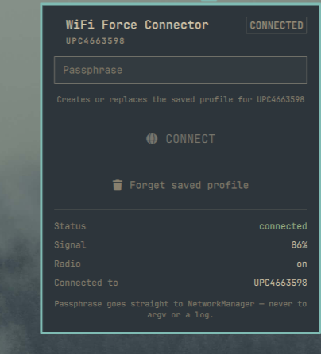

# WiFi Force Connector

A bar button for Omarchy that re-creates your WiFi profile from scratch with a
passphrase you type in — the one-click fix for a machine that is stuck
"disconnected" even though the modem is right there.



## The problem it solves

NetworkManager stores a saved profile per WiFi network, including the
passphrase. When that stored passphrase goes stale — the ISP rotates the WiFi
password, you set a new one on the router, the profile got half-written — the
connection fails with:

```
psk mismatch reported by supplicant
state change: need-auth -> failed (reason 'no-secrets')
```

NetworkManager then asks for a new passphrase, but it asks through a secret
agent that only exists inside a running desktop session. From a script, a TTY,
or a headless context there is no agent, so it fails with `no-secrets` and
retries forever. The adapter looks fine (it still *sees* the network at full
signal) and no amount of retrying helps, because the problem is the stored
key, not the radio.

The normal fix is `nmcli device wifi connect "SSID" password "…"`, which
creates or overwrites the profile and activates it. This plugin puts that
behind one button.

## Install

```bash
omarchy plugin add https://github.com/urijaRom26/omarchy-plugin-wifi-force-connector
```

Then restart the shell if the widget does not appear:

```bash
omarchy restart shell
```

## Use

1. Click the globe button in your bar (it sits after the network icon by
   default).
2. If more than one network is in range, pick one — the choice is remembered.
3. Type the passphrase and press the big **CONNECT** button (or just hit
   Enter).

The button creates or replaces the profile and connects. If the passphrase is
wrong the panel says so and the field stays open for another try. There is also
a **Forget saved profile** button, which deletes the stale profile so the next
CONNECT builds a clean one. Right-clicking the bar icon does the same thing.

The bar button itself shows current state at a glance: ✓ when you are on the
target network, ! when you are not, … while a connection is in flight.

## Which network it targets

In order of precedence:

1. `WIFI_RESCUE_SSID` environment variable, if set.
2. The network you previously picked in the panel (remembered in
   `$XDG_STATE_HOME/urija.wifi-force-connector/ssid`).
3. The strongest encrypted network currently in range.

So it works with no configuration at all, and there is no hardcoded SSID in the
source.

## About the passphrase

The passphrase is handed straight to NetworkManager through Quickshell's
`Network.connectWithPsk()`. It is deliberately **never**:

- passed as a command-line argument (argv is world-readable in `/proc`)
- written to disk by the plugin
- written to any log or the shell journal
- accepted as an IPC argument over `omarchy shell`

Only NetworkManager's own root-owned keyfile under
`/etc/NetworkManager/system-connections/` holds the result, as it does for any
WiFi connection.

The plugin never runs anything as root, and needs no `sudo`. It talks to
NetworkManager over the same session bus the desktop uses.

## The state file, and why it is guarded

The plugin remembers the network you picked in a single file:

```
$XDG_STATE_HOME/urija.wifi-force-connector/ssid
```

That path is predictable, so it is treated as **untrusted**. Before every
write the plugin verifies, in order:

| Check | Meaning | On failure |
| --- | --- | --- |
| `test -L` | not a symlink | refuse — never write through a link |
| `test -e` | does anything exist there? | if absent: create it |
| `test -f` | is it a plain regular file? | refuse (directory, socket, device…) |
| `wc -c` | is it empty? | if non-empty: **refuse to overwrite** |
| `touch` | create if absent | never truncates an existing file |

The reasoning: **ownership is not consent.** A regular file you own may hold
unrelated data, and a symlink may point somewhere else entirely. An earlier
version of this plugin created the file with `install -D /dev/null`, which
truncates whatever regular file already sits at the path — so simply picking a
network could destroy an unrelated file. That was reported in
[issue #9145](https://github.com/omacom/omarchy-plugin-marketplace/issues/9145)
and fixed in 1.0.1.

If the guard refuses a write, the panel says so
(`Not writing state: …`) and the plugin keeps working — it just falls back to
auto-detecting the strongest encrypted network in range. Nothing is ever
overwritten to force it through.

Every step is a fixed argv array. No step passes through a shell, and no step
interpolates user input into a command string.

## Requirements

- NetworkManager (checked at runtime; the panel reports `no NetworkManager`
  rather than misbehaving)
- Quickshell's NetworkManager backend

## Troubleshooting

**The panel says "Can't see &lt;SSID&gt;".** The radio is associated but that
network is not in the scan results. The plugin turns the scanner on while the
panel is open; if the list is stale, close and reopen it.

**"Wrong password".** The handshake timed out authenticating. The field stays
open — type the current router password and press CONNECT again.

**Nothing happens when I click CONNECT.** The button is greyed out until the
passphrase is at least 8 characters (WPA's minimum) and a network is actually
in range. Both conditions are visible in the panel.

## Inspecting it headlessly

The widget exposes a status IPC for scripting and debugging:

```bash
omarchy shell urija.wifi-force-connector status
omarchy shell urija.wifi-force-connector select "MyNetwork"
omarchy shell urija.wifi-force-connector forget
```

## License

MIT — see [LICENSE](LICENSE).
